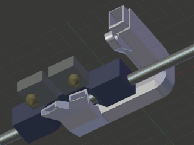

# FlashForge Creator Pro front dual fan duct
*Cooling duct for both extruders of the FlashForge Creator Pro and similar 3D printers (formerly thing:1675208)*

### License
[Creative Commons - Attribution](https://creativecommons.org/licenses/by/4.0/)

### Gallery

[🔎](images/Duct1.jpg) [🔎](images/Duct2.jpg) [🔎](images/DuctV6.jpg) [🔎](images/Duct_v2-front_under.jpg) [🔎](images/Duct_v2-under.jpg) [🔎](images/DuctDump.png)

## Description and Instructions

This is a drop-in replacement fan duct that fits the *FlashForge Creator Pro* and similar models that have the ‘turbo fan’ at the left of the nozzles. It has been confirmed to fit the 2015 FFCP (upwards opening door), the 2016 (sideways door), and the Dreamer. It probably also fits clones like CTC and PowerSpec.

The stock duct has an obvious problem: it only cools the left nozzle. This means it pretty much obliges you to always print filaments like PLA with the left nozzle because they require active cooling for a good result. This new duct offers cooling for both nozzles at the same time, which allows to use any filament with any of the nozzles and also do dual extrusions with proper cooling as well.

After reports that the v4 and v5 versions of this duct did not perform as well as the stock duct (for single extrusion with the left nozzle obviously), I made some more improvements and did some extensive tests that confirmed the new v6 outperforms the stock duct on a particular challenging model. It is possible that the stock duct will still provide better results in specific situations, but those should be rare.

If you're only going to print with a single extruder, check out [the single-extruder variation of this duct](https://github.com/DrLex0/print3D-ffcp-left-cooling-duct), it provides even better cooling.
 

### Pre-printing: check nozzle height

There are two models to choose from. To determine which one you need, do the following test.

[🔎](images/ductalign.jpg)

*Move the bed against the nozzles (as if you are going to use the levelling sheet), then bring the carriage forward and measure the distance between the bed surface and the cradle as shown in the photo.*

The regular duct model is designed to be optimal if this distance is **10 mm,** which is normally the case on a standard FFCP. It should also be this way if you aligned the nozzles with [this leveler](https://www.thingiverse.com/thing:1582720).

The ‘x1’ model is for when this distance is **11 mm.** This is likely the case if you installed Micro Swiss all-metal hot-ends and followed their instructions exactly.

If your nozzles are at a considerably different height, you should consider realigning them. If that's not possible, your only option is to modify the duct model.
 

### Printing

**Do not print this in PLA:** it is likely to deform from the heat of the nozzles and possibly the heated bed as well. The duct must be printed in a filament that can withstand a good amount of heat. PETG is not recommended either: it will deform as I found out by experience. Polycarbonate would be ideal, but is of course more difficult to print. You *might* get away with PLA or PETG if you apply heat insulation as described below, but still I wouldn't recommend this.

**ABS** is generally the most suitable material for this, because it is pretty resistant against heat and it is not terribly difficult to print it on a FFCP.

Make sure to **disable supports,** otherwise the duct may be blocked by material added on the inside. You could use soluble supports, but the model is designed to be printed easily without supports, and a raft or brim should also be unnecessary. Just ensure your bed is well-levelled and you have no problems printing bridges. The model has internal structures to minimise the risk of problems caused by your slicer and printer, but only if you print it with the intake pointing upwards.

I printed this in Slic3r with 0.2 mm layers, 100% infill, *no* supports and no raft. I used two perimeters, 2 top layers and 2 bottom layers. Do not try to skimp on infill: the model consists almost entirely of thin walls anyway. 100% is needed to ensure strength of the few small solid parts. You won't be saving much filament or weight by trying to enforce a lower infill, it would only make the duct weaker.

Do not rush this print. To get a strong result, print *slowly* and only provide the minimum amount of cooling necessary. If you can control fan speed (which is **not** the case on an unmodified FFCP), you can enable it all the time on an ABS print at about 10% to 20%. Otherwise, only enable the fan while overhangs are being printed. You should get an OK result without fan altogether.

Printing in a translucent material has the advantage that it will pass through some of the light from the LED strip, but it is advisable anyhow to add [an extra LED](https://github.com/DrLex0/print3d-ffcp-x-led-mount) to get a better view on what is being printed.
 

### Post-printing

The only essential post-processing step is to ream the small hole next to the screw with a 2mm drill, this will ensure a perfect and snug fit.

The tips of the exhausts are very close to the heater blocks, which can cause deformation over time. This should not be too much of a problem if you only print PLA at relatively low temperatures, especially considering that the fan should be always on for PLA hence the duct will keep itself cooled. When printing ABS or PETG however, or other filaments that require a high extrusion temperature with little cooling, the duct is likely to deform, even if it was printed in ABS.
The most effective way to mitigate this, is to cover the tips of the exhausts in a layer of insulating material. What works really well is one layer of self-adhesive aluminium foil with a layer of kapton on top, as shown in the photo below. A few layers of foil or kapton alone however will probably be effective as well.

[🔎](images/duct-insulation.jpg)

*Insulating the duct like this will ensure it won't deform even when printing at high temperatures.*

You can also add some extra heat insulation to your hot-end heater blocks (especially the front). This helps to avoid that the blocks lose heat when air from the exhausts is reflected against the bed during the lower part of the print. A few layers of kapton tape might be sufficient, but an extra layer of true insulation material will be more effective. I found some insulation on eBay that I could cut into strips, and by making a hole with a perforator, I can push-fit the insulation onto the round element in the heater block, which makes it easy to remove.
 

### Installing

Mounting is very easy. You will have a tiny bit of margin to wiggle the duct up and down, ensure it is not rubbing against the rail by pushing it down while tightening the screw. The little tab should be resting on top of the cradle. I recommend to glue a thin piece of rubber (or flexible filament) onto the carriage under the tab, such that the duct won't rattle due to vibrations.

Even though it is considerably larger than the stock fan duct, my ABS print of the v5 duct weighs exactly the same as the stock duct so there should be no impact on print performance.

If you want to retrofit the blower fan and this duct on an older printer that does not have the mounting bracket, you can print [my clone of it](https://www.thingiverse.com/thing:2086927).
 

### Using

Just as with the stock duct, a limitation is that it only blows in one direction, meaning that parts in the ‘shadow’ of the nozzle (i.e. at the back) will get the least cooling. If possible, orient the model such that overhangs or whatever parts should look best, are at the front. Again, if you will only be printing with one extruder, the [single-extrusion variation of this duct](https://github.com/DrLex0/print3D-ffcp-left-cooling-duct) reduces the shadow problem.

If you're going to do a long print where the fan is not needed, you should remove the duct altogether. This is especially the case with filaments like polycarbonate that need to be printed at very high temperatures. When no air is flowing through the duct, the long exposure to the heat of the extruders is very likely to cause the exhausts to deform, even if printed in ABS and even if you applied extra insulation.

You can enable the fan on ABS prints to improve quality, but this will greatly increase the risk of warping and cracking. Enabling the fan continuously with ABS is only feasible in the following cases:
* for small objects printed with thin layers. Be sure to increase your print temperature if you do, and seal the enclosure to keep the air inside cozy and warm. A raft can also help to prevent warping.
* for large objects when using the smart cooling features of your slicer software to only enable the fan during short periods while printing overhangs.
* if you can drastically reduce the speed of the fan. Don't bother trying to vary the speed in your slicer program, the fan circuit in the FFCP is on/off only. The simplest way to obtain variable fan speed is by installing a hardware [PWM controller](https://www.thingiverse.com/thing:2095862). There are also some custom Sailfish firmware builds that have a software PWM implementation, but it is limited. A more complicated but also fully automatic solution is [this one](https://github.com/DrLex0/MightyVariableFan), where fan speed is delegated to a separate controller steered by commands in the print code itself.

Similar remarks hold for PETG: it is very sensitive to cooling but you will obtain nicer prints when applying just a tiny bit of cooling, which is only possible by controlling fan speed.
 

If you really like this and want to show appreciation for the work I've put into this, [a small tip is always welcome](https://www.dr-lex.be/about/#contact).
 

## How I Designed This

### The basics

The screw mounting part was taken from [FFCP DUCT by natewin](https://www.thingiverse.com/thing:1469817), for the rest this was designed from scratch.

[🔎](images/Windmill_test.jpg)

*The ‘windmill test’*

I created the first iteration by measuring the dimensions of the FFCP printing assembly with a caliper, and making a rough model of it in Blender. Then I constructed the duct around this model. For the exhaust shapes I started out with a wet-finger guess. This seemed to do the job at first but eventually I noticed it didn't perform well. To find out in what direction the air really was being blown, I printed a small windmill that can be mounted on an empty ballpoint refill, and enabled the fan with a custom x3g file. This showed the air was aimed way too much downward, and also at a wrong angle in the horizontal plane. So I tweaked the exhaust shapes and printed new ones, testing them with the little windmill until the airflow was just right. Of course I didn't re-print the entire duct every time, only the exhaust part which I attached to the decapitated duct with some adhesive tape (nope, not with *duct* tape, just ordinary tape).

I did the same windmill test on the stock fan duct and it suffers from a poorly aimed airflow. So even if you will never print with more than one nozzle, this should still be a noticeable upgrade.

### The refinements

[🔎](images/DuctSCIENCE.jpg)

For the v6 version, I went even further and compared the performance of new prototypes to the stock duct and the v5. For this, I created a small [mushroom-shaped model](http://www.thingiverse.com/thing:2005832) which I printed in PLA at a higher temperature than usual. This model warps like crazy without proper cooling. Because my duct blows from the front unlike the stock duct which blows from the left, I manipulated the test GCode file by rotating all coordinates 90° clockwise to make the comparison as fair as possible. This ensured that when printing the test with the stock duct, exactly the same movements were made with the air blowing roughly from the same direction w.r.t. the orientation of the model.
 

## Updates

### Version 2 (July 27, 2016)
If you printed the first version, you will definitely want to upgrade to this one: the first version directed its air way too much downwards and performed even worse than the stock duct (which also doesn't really produce any appreciable airflow at the height of the nozzle). This new duct should allow to print overhangs that previously ended in disaster, with *both* nozzles. Moreover, it requires less material, making it lighter than the first one.

### Version 3 (October 1, 2016)
This is a minor upgrade from v2, the only differences are that it has thinner walls and other tweaks to require less material, and I modified the bottom to reduce obstruction of the view. I specifically made this version to be printed in PETG. Even though PETG is considerably heavier than ABS, thanks to the weight trimming v3 weighs less in PETG than v2 did in ABS. However, my PETG duct eventually started to melt so I do not recommend it, unless you always enable the fan and print at low temperatures.

### Version 4 (October 15, 2016)
Again small changes, most important is that the exhausts are slightly further away from the heaters, this provides a better directed airflow and lower risk of melting. Also some more weight trimming.

### Version 5 (December 18, 2016)
Added plugs, rounded one of the corners mainly for aesthetic reasons (although it could help a bit to reduce turbulence), also improved airflow where the exhaust joins the main body. Again shaved off a bit of material as well, and tweaked some of the internal structures to reduce the risk that slicer programs will make a mess out of the ‘ceiling’ part.
(Small update December 20th: chamfered the inlet as per suggestion by user FlashErase, to make it easier to install the duct.)

### Version 6 (December 30, 2016)
Increased the radius of the front right corner (this really should reduce turbulence), and made other small airflow improvements. Redesigned the exhausts to be larger and better directed, and incorporated small baffles to ensure the air is aimed directly at the nozzles. Also incorporated small details that increase the chance of good bridging. Small bonus: it produces a slight jet engine sound.

Removed the v2 model: the v6 should be so easy to print and is so much better than the v2, that there is no point anymore in allowing people to print this old version. Dropped the plugs as well: they were way too finicky to install and remove, and they caused the fan to spin faster, which could cause it to wear out quickly.

### Version 6r (May 7 and Dec 19, 2017)
No functional differences with v6, only some reinforcements have been added around the region where the duct is the weakest. If you have already printed the v6 and do not have problems with it, then there is no reason to print this one.

Dec 19: added the ‘x1’ variation, which has the exhausts 1 mm lower than the normal duct, in case your nozzles are 1 mm lower than the stock nozzles (e.g. you installed all-metal hot-ends).

### Version 6s (Apr 25, 2020)
Even fewer changes, there is absolutely no need to re-print this if you already have v6r. The only change, besides leaving the sinking ship of Thingiverse, is that I removed the tiny bit that was still a copy of natewin's model, and made it again from scratch. (I found it a bit ridiculous to have to label this as a remix just because of that tiny shared part.)

### Future plans
When I find the time, I will run this duct through the same kind of CFD simulations as I have done with the [single-extruder variation](https://github.com/DrLex0/print3D-ffcp-left-cooling-duct), to ensure the flows are as optimal as possible within the limitations of this design.

## Tags

`baffle`, `cooling`, `cooling_duct`, `dual_extrusion`, `fan_duct`, `FFCP`, `FFCPRo`, `FlashForge_Dreamer`, `upgrade`
